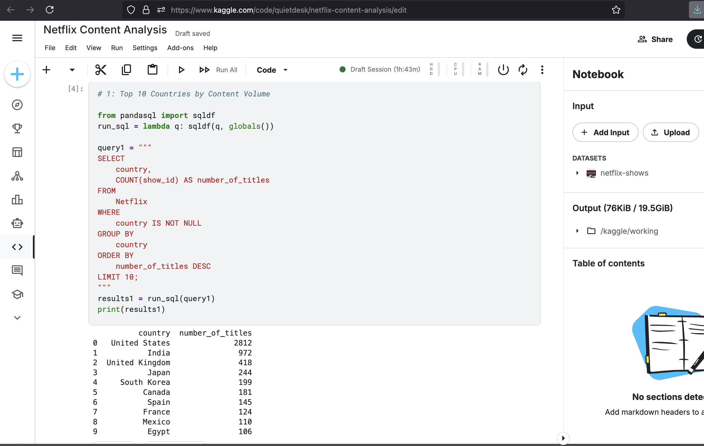
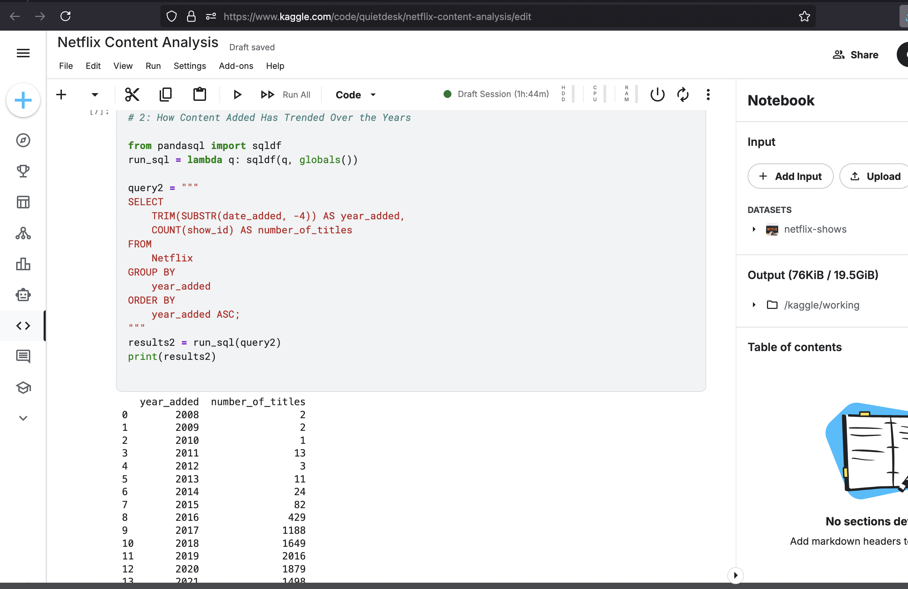
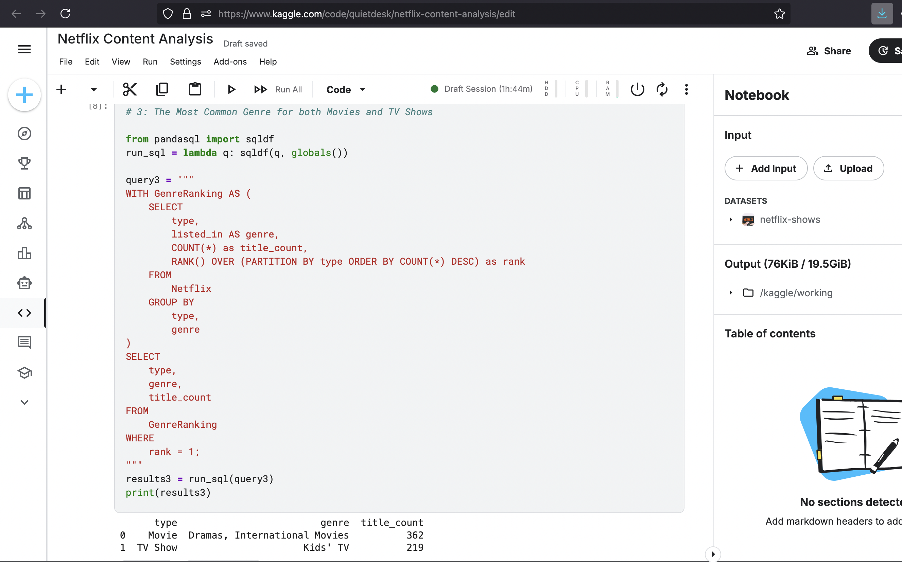
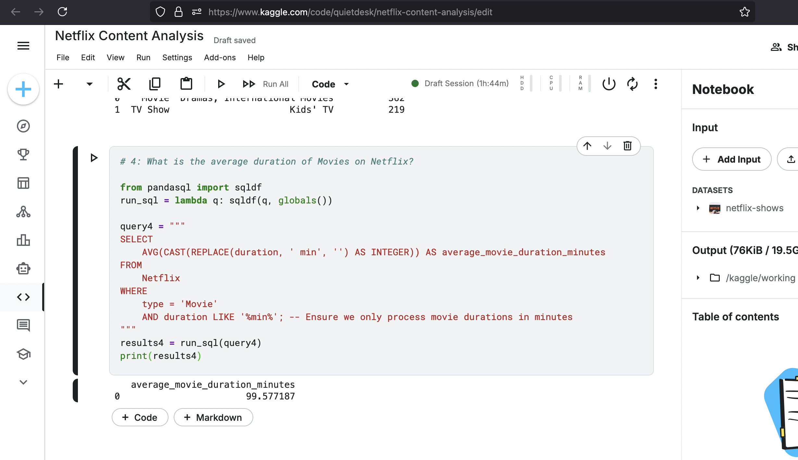

Capstone Project: An SQL-Based Analysis of the Netflix Content Library
Project Overview

This capstone project is an end-to-end analysis of the Netflix Movies and TV Shows dataset. The objective was to act as a data analyst for Netflix's content team and use SQL to explore their existing catalog. By analyzing trends in content production, popular genres, and content characteristics, actionable insights were derived that could help inform future content acquisition and strategy.

This project synthesizes a full range of SQL skills, from basic data aggregation and string manipulation to advanced analytical techniques like Common Table Expressions (CTEs) and Window Functions.

    Tools: SQL (executed within a Python/pandasql environment), Kaggle Notebooks

    Dataset: Netflix Movies and TV Shows (Kaggle)

Key Findings & Analysis

The analysis was guided by several key business questions aimed at understanding Netflix's content strategy.
Finding 1: The United States and India are the dominant content production hubs.

To understand the geographical distribution of content production, The entire catalog was grouped by country and counted the number of titles.

Query:
code SQL

    
SELECT
    country,
    COUNT(show_id) AS number_of_titles
FROM
    Netflix
WHERE
    country IS NOT NULL
GROUP BY
    country
ORDER BY
    number_of_titles DESC
LIMIT 10;

  

Supporting Data:

Business Insight: This finding highlights the key markets where Netflix has either strong production partnerships or a large volume of acquired local content. A recommendation would be to analyze the performance of this content in other regions to identify potential for international distribution.
Finding 2: The volume of content added to Netflix peaked dramatically between 2016 and 2019.

To identify trends in content acquisition, The year from the date_added field was extracted. This required cleaning the string data to isolate the year and then grouping by it to count the number of titles added annually.

Query:
code SQL

    
SELECT
    TRIM(SUBSTR(date_added, -4)) AS year_added,
    COUNT(show_id) AS number_of_titles
FROM
    Netflix
GROUP BY
    year_added
ORDER BY
    year_added ASC;
Supporting Data:

**Business Insight:** This trend clearly illustrates Netflix's aggressive content expansion strategy during the late 2010s, likely a strategic move to build a large library in the face of growing competition in the streaming market.

---

#### Finding 3: "Dramas" are the most common genre for Movies, while "International TV Shows" lead for TV Series.

To understand the content mix more deeply, the most common genre for both Movies and TV Shows was found independently. This required an advanced query using a CTE and the `RANK()` window function to find the top genre *within each content type*.

**Query:**
sql
WITH GenreRanking AS (
    SELECT
        type,
        listed_in AS genre,
        COUNT(*) as title_count,
        RANK() OVER (PARTITION BY type ORDER BY COUNT(*) DESC) as rank
    FROM
        Netflix
    GROUP BY
        type,
        genre
)
SELECT
    type,
    genre,
    title_count
FROM
    GenreRanking
WHERE
    rank = 1;

  

Supporting Data:

Business Insight: This reveals a key part of the content strategy: leveraging a broad, internationally diverse catalog for TV shows to appeal to a global audience, while relying on the traditionally popular "Drama" genre for feature films.
Finding 4: The average duration of a Netflix movie is approximately 99 minutes.

To provide a benchmark for content length, the average duration of all movies in the catalog was calculated. This required filtering for 'Movie' types and then cleaning the duration column (e.g., converting the string '90 min' into the number 90) before applying the AVG() function.

Query:
code SQL

    
SELECT
    AVG(CAST(REPLACE(duration, ' min', '') AS INTEGER)) AS average_movie_duration_minutes
FROM
    Netflix
WHERE
    type = 'Movie'
    AND duration LIKE '%min%';

  

Supporting Data:

Business Insight: An average duration of 99 minutes suggests a focus on standard feature-length films. This benchmark can be used by the content acquisition team when evaluating new movie deals to see how they align with the existing catalog's profile.
