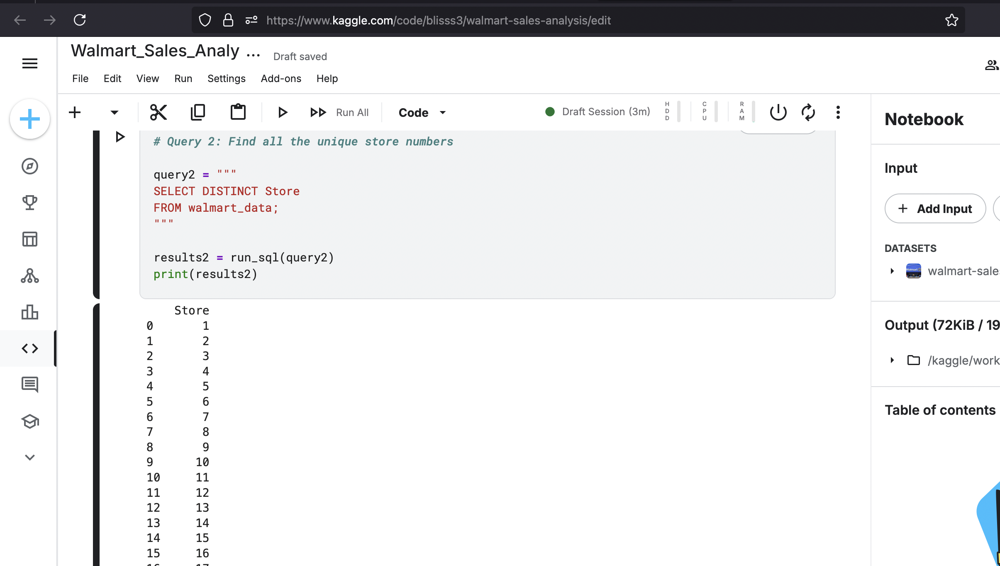
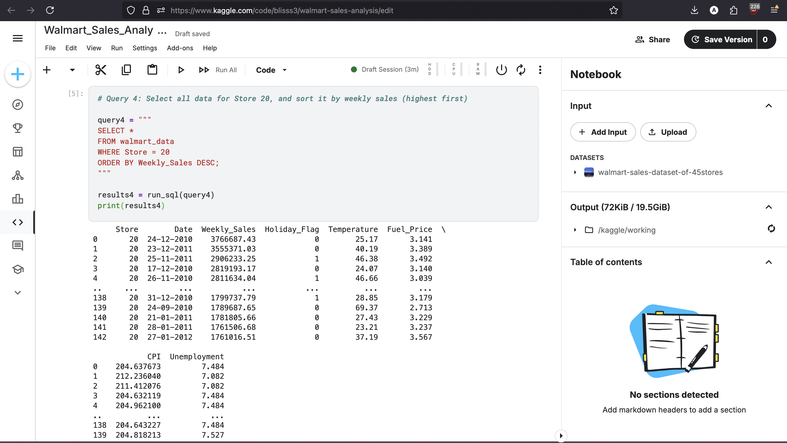
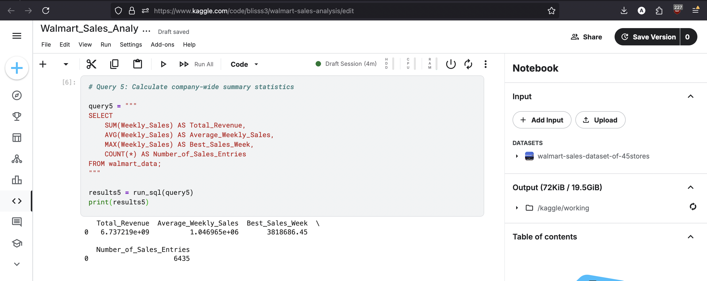
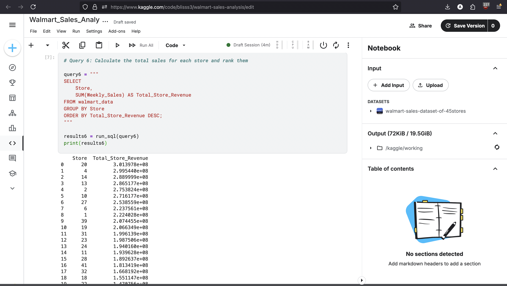

Project 1: Walmart Sales Analysis
Project Overview

This project serves as a foundational analysis of the Walmart Sales dataset. The primary objective was to leverage fundamental SQL commands to explore the data, identify sales trends, and derive key business insights. This analysis demonstrates the core workflow of a data analyst: asking questions, retrieving and manipulating data, and summarizing the findings.

    Tools: SQL (within a Python/pandasql environment), Kaggle Notebooks

    Dataset: Walmart Sales Dataset of 45 Stores (Kaggle)

Key Questions and Analysis

The analysis was broken down into four main tasks, each designed to answer a specific business question using a core SQL concept.
1. What is the scope of our dataset? (Data Retrieval)

To begin, I needed to understand the breadth of the data. I wrote a query to identify all the unique stores present in the dataset.

Query:
code SQL

    
SELECT DISTINCT Store
FROM walmart_data;

  

Result:
This query confirmed that the dataset contains sales data for 45 unique stores, setting the stage for more detailed analysis.

2. Which were the best-performing weeks for a specific store? (Filtering & Sorting)

To drill down into performance, I filtered the data to isolate a single store (Store 20) and then sorted the results to quickly identify its highest-grossing sales weeks.

Query:
code SQL

    
SELECT
    Store,
    Date,
    Weekly_Sales
FROM walmart_data
WHERE Store = 20
ORDER BY Weekly_Sales DESC;

  

Result:
The output immediately highlights the top sales weeks, which a manager could then investigate for potential causes (e.g., holidays, promotions).

3. What are the overall sales metrics for the entire company? (Aggregations)

To get a high-level view of the business, I used aggregate functions to calculate the total revenue, average weekly sales, and the single best sales week across all 45 stores.

Query:
code SQL

    
SELECT
    SUM(Weekly_Sales) AS Total_Revenue,
    AVG(Weekly_Sales) AS Average_Weekly_Sales,
    MAX(Weekly_Sales) AS Best_Sales_Week
FROM walmart_data;

  

Result:
This query provides crucial, top-line metrics that are essential for business reports and performance tracking.

4. Which stores are the top revenue generators? (Grouping Data)

This is the most impactful query of the analysis. I used the GROUP BY clause to segment the data by store and calculated the total revenue for each one. By ordering the results, I created a ranked list of the top-performing stores.

Query:
code SQL

    
SELECT
    Store,
    SUM(Weekly_Sales) AS Total_Store_Revenue
FROM walmart_data
GROUP BY Store
ORDER BY Total_Store_Revenue DESC;

  

Result:
This analysis provides a clear, actionable list of the most valuable stores, allowing the business to focus resources, study what makes these stores successful, and identify underperforming locations.

Key Learnings and Skills Demonstrated

    Data Retrieval & Exploration: Proficient in using SELECT and SELECT DISTINCT to explore and understand a dataset.

    Data Filtering & Sorting: Demonstrated ability to use WHERE and ORDER BY to isolate specific data points and rank results to answer targeted questions.

    Data Aggregation: Successfully used SUM(), AVG(), and MAX() to perform calculations and derive summary statistics.

    Data Segmentation: Mastered the GROUP BY clause to segment data and perform analysis on specific categories, a cornerstone of business intelligence.

    Business Acumen: Showcased the ability to translate business questions into technical SQL queries and interpret the results to provide actionable insights.
