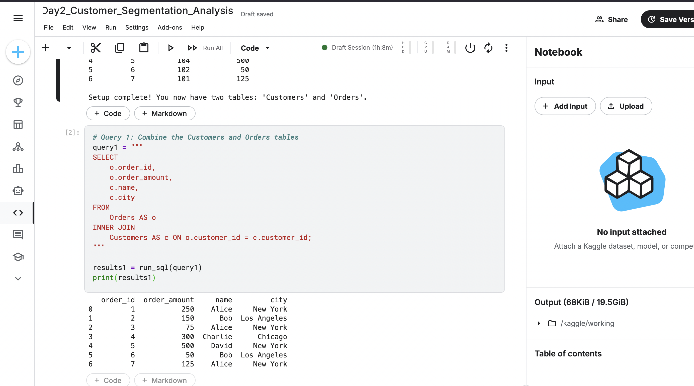
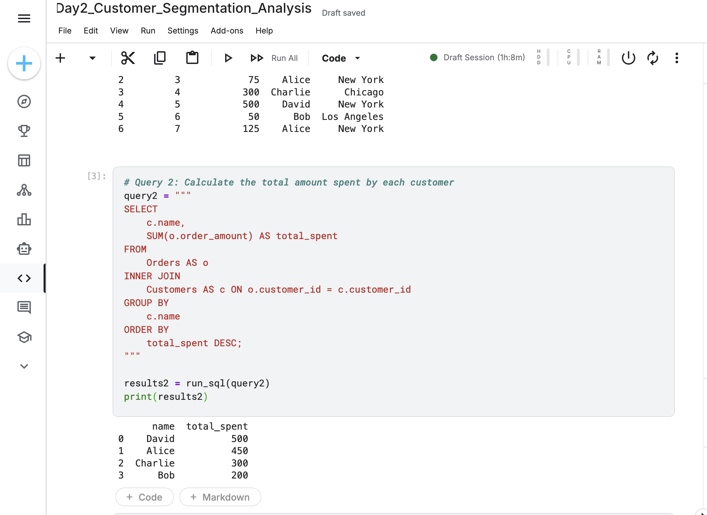
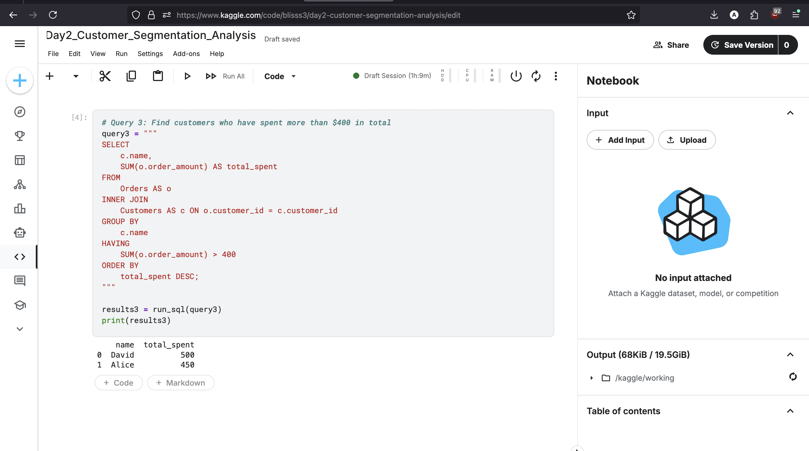

Project 2: Customer Segmentation Analysis
Project Overview

This project advances beyond single-table analysis to tackle a more realistic business scenario: working with a relational database. Using two separate tables—Customers and Orders—this analysis focuses on joining data to segment customers and identify high-value individuals. This is a critical skill for any data analyst, as it unlocks the ability to see the relationships within the data.

    Tools: SQL (within a Python/pandasql environment), Kaggle Notebooks

    Core Concepts: INNER JOIN, Table Aliases, GROUP BY across joins, HAVING clause for filtering aggregated data.

Key Questions and Analysis

The analysis was structured to build upon the complexity of the queries, starting with a simple join and ending with a filtered, aggregated result.
1. How can we get a complete view of each order? (INNER JOIN)

The initial data was split. To get a meaningful view, I first combined the Orders and Customers tables based on their common customer_id. This created a unified list showing who placed each order.

Query:
code SQL

    
SELECT
    o.order_id,
    o.order_amount,
    c.name,
    c.city
FROM
    Orders AS o
INNER JOIN
    Customers AS c ON o.customer_id = c.customer_id;

  

Result:
This query successfully combines the two tables, providing a holistic view of every transaction.



2. Which customers have spent the most? (GROUP BY across a JOIN)

With the data combined, I could now calculate the total spending for each individual customer. I grouped the joined data by customer name and summed their order amounts to create a ranked list of customer value.

Query:
code SQL

    
SELECT
    c.name,
    SUM(o.order_amount) AS total_spent
FROM
    Orders AS o
INNER JOIN
    Customers AS c ON o.customer_id = c.customer_id
GROUP BY
    c.name
ORDER BY
    total_spent DESC;

  

Result:
This analysis provides a clear ranking of customers by their total spending, a key metric for any sales-driven business.



3. Who are our "High-Value" customers? (HAVING Clause)

The final step was to segment our customers. I used the HAVING clause to filter the aggregated results, isolating only those customers who had a total spending of over $400. This is a practical example of customer segmentation.

Query:
code SQL

    
SELECT
    c.name,
    SUM(o.order_amount) AS total_spent
FROM
    Orders AS o
INNER JOIN
    Customers AS c ON o.customer_id = c.customer_id
GROUP BY
    c.name
HAVING
    SUM(o.order_amount) > 400
ORDER BY
    total_spent DESC;```
**Result:**
*This final query produces an actionable list of high-value customers that a marketing team could target for special promotions or loyalty programs.*



---

### **Key Learnings and Skills Demonstrated**

*   **Relational Data Joining:** Mastered the use of `INNER JOIN` to combine data from multiple tables based on a common key, a fundamental real-world skill.
*   **Advanced Filtering:** Demonstrated a clear understanding of the difference between `WHERE` (filters pre-aggregation) and `HAVING` (filters post-aggregation) to correctly answer complex business questions.
*   **Code Readability:** Utilized table aliases to write cleaner, more professional, and more efficient SQL queries.
*   **Customer Segmentation:** Applied SQL skills to a practical business problem, successfully segmenting a customer base into a "high-value" group.

---


