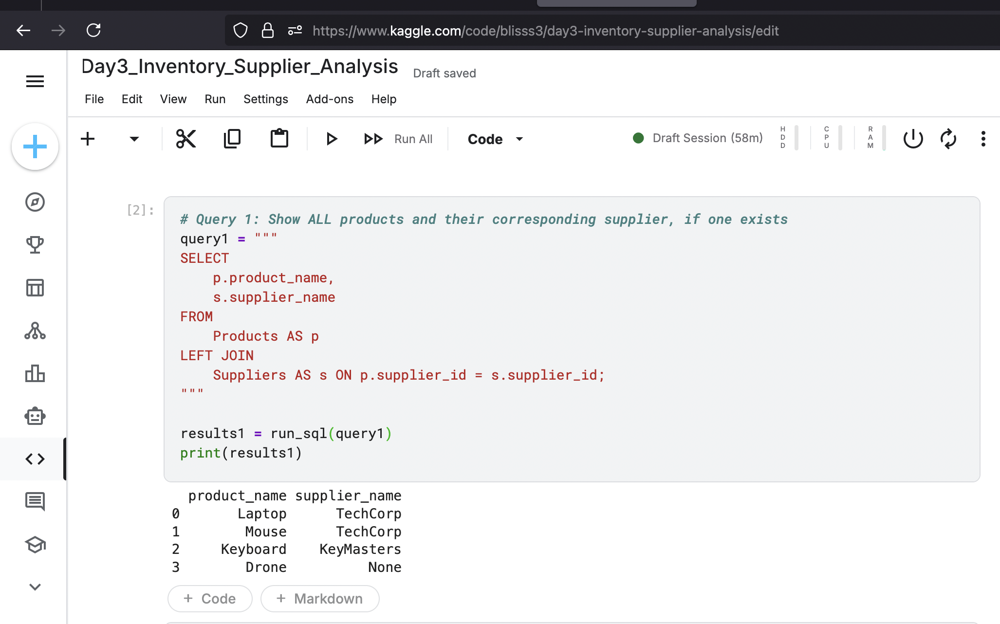
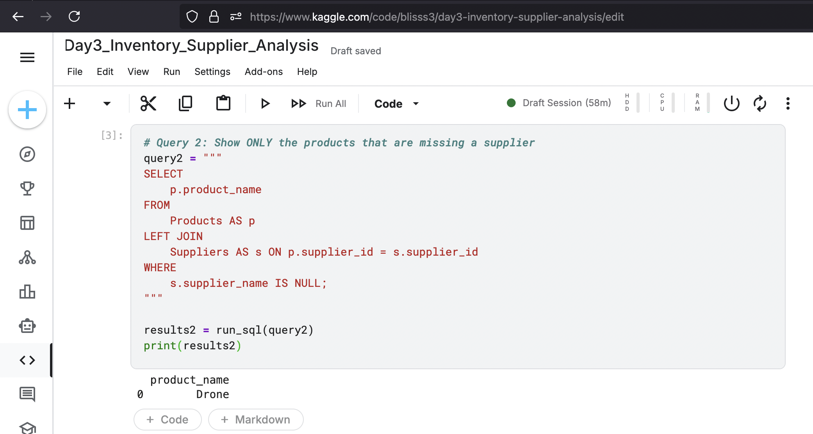
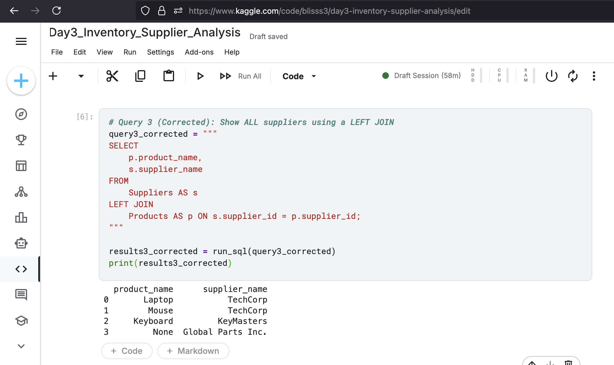
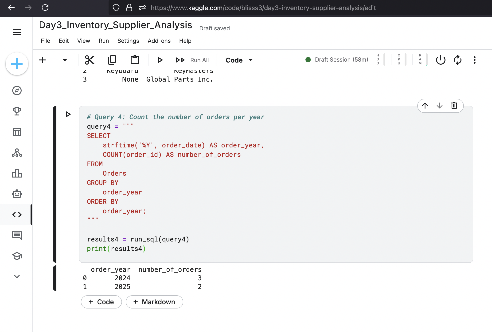

Project 3: Inventory and Supplier Analysis
Project Overview

This project focuses on a common and critical business intelligence task: identifying gaps in data by joining multiple tables. Using a dataset of products, suppliers, and orders, I analyzed the relationships between them to find products without suppliers and suppliers without products. This project also includes my first time-series analysis, aggregating data by year.

A key part of this project was encountering a limitation in the pandasql library and using problem-solving to achieve the desired outcome with an alternative query.

    Tools: SQL (within a Python/pandasql environment), Kaggle Notebooks

    Core Concepts: LEFT JOIN, RIGHT JOIN (and its logical equivalent using LEFT JOIN), IS NULL for handling missing data, and basic Date Functions (strftime).

Analysis and Key Queries
1. Which products in our catalog are missing a supplier? (LEFT JOIN & IS NULL)

The first business question was to identify any products that were not linked to a supplier. An INNER JOIN would hide this information, so a LEFT JOIN was essential.

Step 1.1: Show all products and their suppliers.
The LEFT JOIN keeps every record from the "left" table (Products), showing a NULL value for any product that doesn't have a matching supplier_id in the Suppliers table.

Query:
code SQL

    
SELECT
    p.product_name,
    s.supplier_name
FROM
    Products AS p
LEFT JOIN
    Suppliers AS s ON p.supplier_id = s.supplier_id;

  

Result:
The output clearly shows "Drone" with a NULL supplier, immediately highlighting the data gap.



Step 1.2: Filter to show ONLY the products without suppliers.
By adding a WHERE ... IS NULL clause, I created a clean, actionable list for the inventory management team.

Query:
code SQL

    
SELECT
    p.product_name
FROM
    Products AS p
LEFT JOIN
    Suppliers AS s ON p.supplier_id = s.supplier_id
WHERE
    s.supplier_name IS NULL;

  

Result:
This query provides the final answer: "Drone" is the product missing a supplier.



2. Are there any suppliers we aren't using? (RIGHT JOIN & Problem-Solving)

The next question was the inverse: find suppliers who are not providing any of our current products. The logical tool for this is a RIGHT JOIN. However, the pandasql library does not support this function.

Challenge: The initial RIGHT JOIN query produced an OperationalError.
Solution: I reframed the query. A RIGHT JOIN of Products to Suppliers is logically identical to a LEFT JOIN of Suppliers to Products. By flipping the tables, I achieved the same result. This demonstrates adaptability to tool limitations.

Corrected Query:
code SQL

    
SELECT
    p.product_name,
    s.supplier_name
FROM
    Suppliers AS s
LEFT JOIN
    Products AS p ON s.supplier_id = p.supplier_id;

  

Result:
The output successfully identifies "Global Parts Inc." as a supplier with no associated products, providing valuable information for supply chain management.



3. How many orders did we receive per year? (Date Functions & Time-Series Analysis)

The final task was to analyze order trends over time. I used the strftime function to extract the year from the order_date and then grouped by this new field to count the total orders for each year.

Query:
code SQL

    
SELECT
    strftime('%Y', order_date) AS order_year,
    COUNT(order_id) AS number_of_orders
FROM
    Orders
GROUP BY
    order_year
ORDER BY
    order_year;```
**Result:**
*This query creates a simple summary report showing the annual order volume, the first step in any time-series analysis.*



---

### **Key Learnings and Skills Demonstrated**

*   **Outer Joins:** Mastered `LEFT JOIN` to find and analyze incomplete or missing relationships between datasets.
*   **Handling Nulls:** Proficiently used `IS NULL` to filter for and report on data gaps, a critical data cleaning and validation skill.
*   **Problem-Solving:** Demonstrated adaptability by successfully working around a tool's limitation (`RIGHT JOIN` not supported) and re-framing the query with a `LEFT JOIN` to achieve the same analytical goal.
*   **Date & Time Functions:** Gained experience with date manipulation by extracting parts of a date (`strftime`) to enable time-based aggregation and analysis.

---
