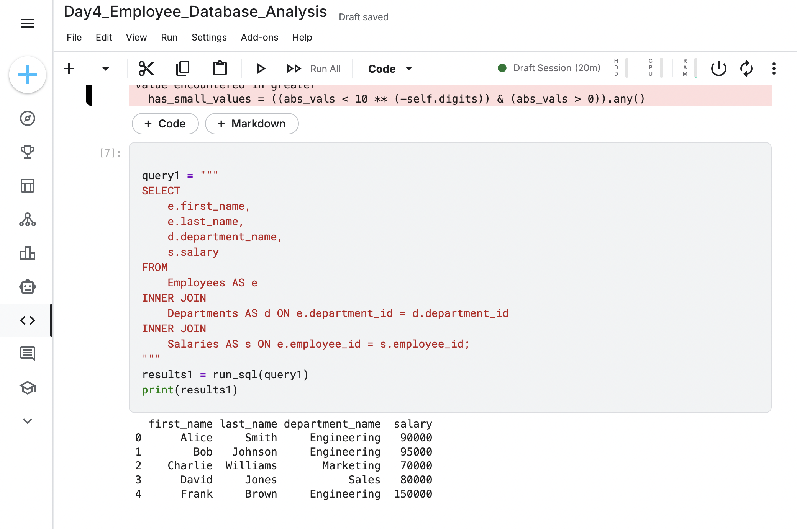
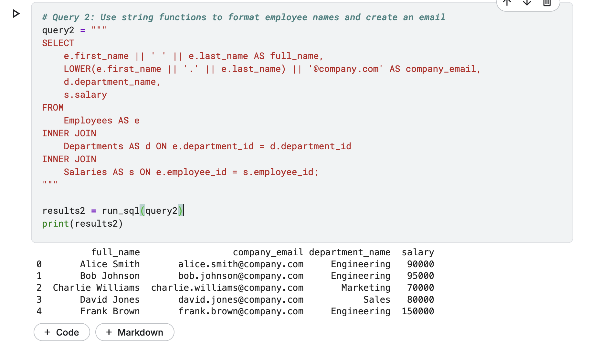
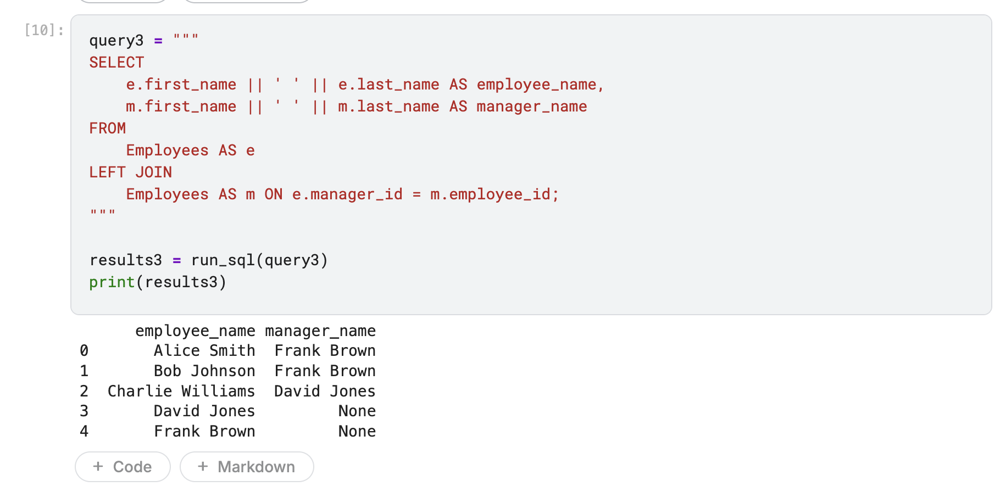

Project 4: Employee Database Analysis
Project Overview

This project simulates a common HR data analysis task. Working with a normalized database split across three tables (Employees, Departments, Salaries), the goal was to synthesize this information into a single, comprehensive report. This analysis demonstrates the ability to join multiple tables, format data for professional presentation, and analyze hierarchical structures using the powerful SELF JOIN technique.

    Tools: SQL (within a Python/pandasql environment), Kaggle Notebooks

    Core Concepts: Multi-table INNER JOIN, String Functions (CONCAT, LOWER), and SELF JOIN with LEFT JOIN to handle hierarchies.

Analysis and Key Queries

The analysis was performed in stages, starting with data integration and culminating in a detailed report showing the organizational structure.
1. Building a Unified Employee Report (Multi-Table Join)

The first step was to de-normalize the data by joining the three tables to create a core report showing each employee's name, department, and salary.

Query:
code SQL

    
SELECT
    e.first_name,
    e.last_name,
    d.department_name,
    s.salary
FROM
    Employees AS e
INNER JOIN
    Departments AS d ON e.department_id = d.department_id
INNER JOIN
    Salaries AS s ON e.employee_id = s.employee_id;

  

Result:
This query successfully combines the disparate tables into a single, useful view of employee data.



2. Enhancing the Report with Data Formatting (String Functions)

To make the report more professional and readable, I used string functions to combine the first and last names into a single full_name column and to generate a standardized company email address for each employee.

Query:
code SQL

    
SELECT
    e.first_name || ' ' || e.last_name AS full_name,
    LOWER(e.first_name || '.' || e.last_name) || '@company.com' AS company_email,
    d.department_name,
    s.salary
FROM
    Employees AS e
INNER JOIN
    Departments AS d ON e.department_id = d.department_id
INNER JOIN
    Salaries AS s ON e.employee_id = s.employee_id;```
**Result:**
*This demonstrates an attention to detail and the ability to format data for real-world business use cases.*



---

#### 3. Uncovering the Organizational Hierarchy (The `SELF JOIN`)
The most complex task was to identify each employee's manager. Since a manager is also an employee, this required joining the `Employees` table to itself. A `LEFT JOIN` was used to ensure that top-level employees without a manager (like the CEO) were included in the report.

**Query:**
sql
SELECT
    e.first_name || ' ' || e.last_name AS employee_name,
    m.first_name || ' ' || m.last_name AS manager_name
FROM
    Employees AS e
LEFT JOIN
    Employees AS m ON e.manager_id = m.employee_id;

  

Result:
This query successfully maps out the direct reporting structure within the company, a crucial piece of HR analysis.


