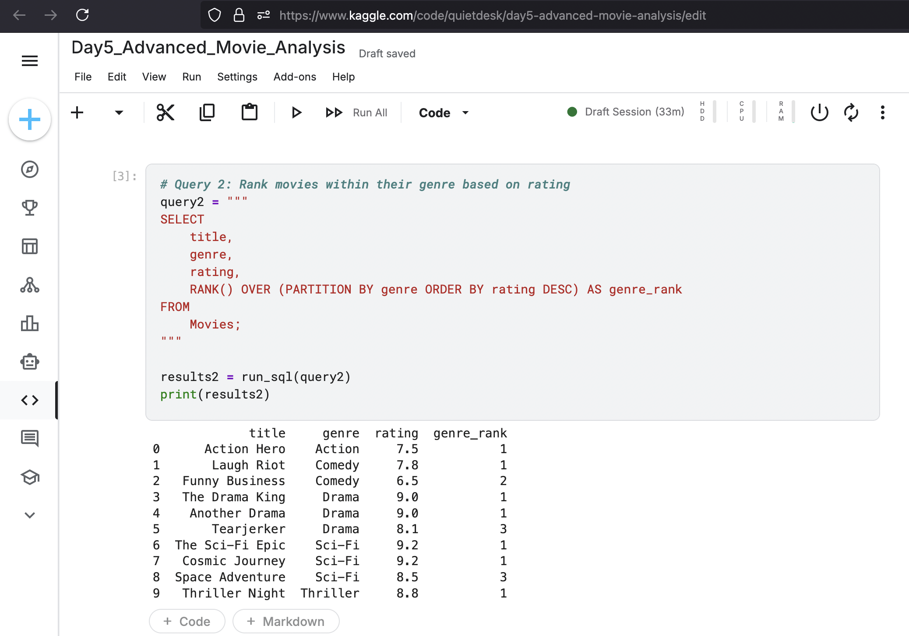
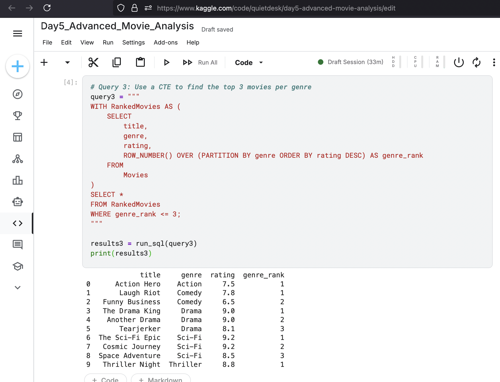
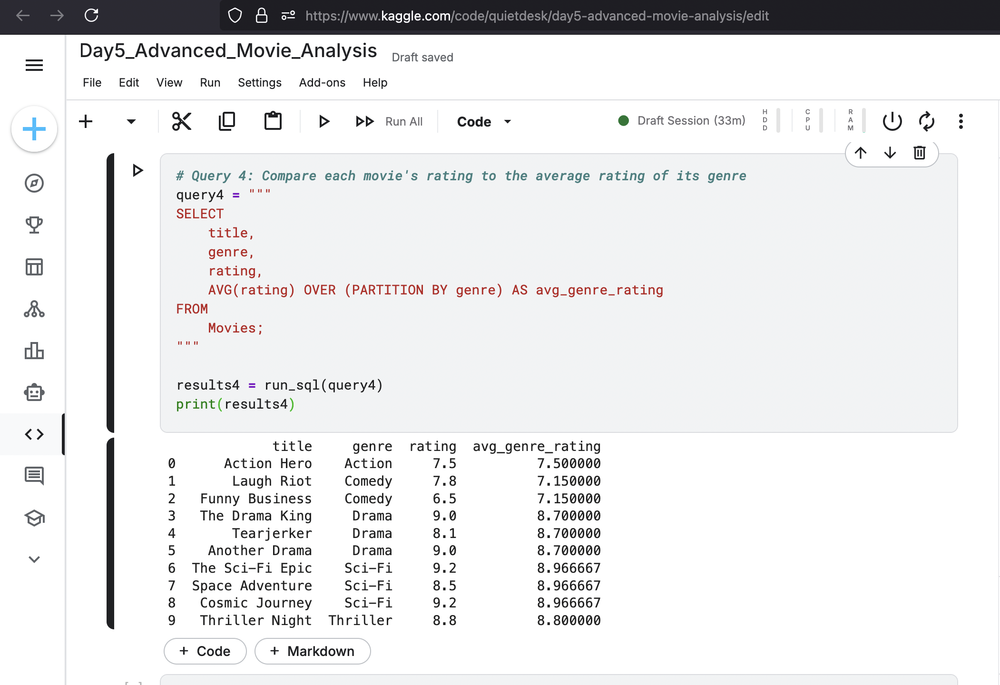

Project 5: Advanced Movie Analysis with Window Functions
Project Overview

This project moves into advanced analytical SQL, focusing on the use of Window Functions and Common Table Expressions (CTEs). These tools are essential for performing complex analyses like ranking items within a category or comparing individual rows to a group average. The goal was to analyze a movie dataset to identify the top 3 movies within each genre and to compare each movie's rating against its genre's average.

    Tools: SQL (within a Python/pandasql environment), Kaggle Notebooks

    Core Concepts: RANK(), ROW_NUMBER(), AVG() OVER (PARTITION BY ...) (Window Functions), and WITH clause (Common Table Expressions).

Analysis and Key Queries

The analysis was structured to first demonstrate the power of window functions and then to combine them with CTEs to produce a clean, filtered final report.
1. Ranking Movies Within Each Genre (RANK())

The first objective was to rank movies not overall, but within their respective genres. A simple ORDER BY would be insufficient. The RANK() window function, partitioned by genre, was the perfect tool.

Query:
code SQL

    
SELECT
    title,
    genre,
    rating,
    RANK() OVER (PARTITION BY genre ORDER BY rating DESC) AS genre_rank
FROM
    Movies;

  

Result:
This query correctly assigns a rank to each movie relative to others in its genre, with the ranking restarting for each new genre. It also correctly handles ties in the ratings (e.g., in the 'Drama' genre).

2. Identifying the Top 3 Movies per Genre (CTE + ROW_NUMBER())

With the ranking logic established, the next step was to filter for only the top 3 movies in each category. This cannot be done in a single step; a window function's result cannot be used in the WHERE clause of the same query. The standard professional solution is to use a Common Table Expression (CTE).

Query:
code SQL

    
WITH RankedMovies AS (
    SELECT
        title,
        genre,
        rating,
        ROW_NUMBER() OVER (PARTITION BY genre ORDER BY rating DESC) AS genre_rank
    FROM
        Movies
)
SELECT *
FROM RankedMovies
WHERE genre_rank <= 3;

  

Result:
This two-step process—first ranking the movies in a CTE and then filtering on that rank in the main query—produces a clean and accurate report of the top 3 movies for each genre.

3. Comparing a Movie's Rating to its Genre Average (AVG() OVER)

The second business question was to see how each movie's rating compared to the average for its genre. A GROUP BY would collapse the data, hiding the individual movie details. An aggregate window function solves this by calculating the group average and displaying it on every row within that group.

Query:
code SQL

    
SELECT
    title,
    genre,
    rating,
    AVG(rating) OVER (PARTITION BY genre) AS avg_genre_rating
FROM
    Movies;

  

Result:
This powerful query provides rich context. We can now see not only a movie's rating but also whether it is performing above or below the average for its peers, without losing any of the original data granularity.

