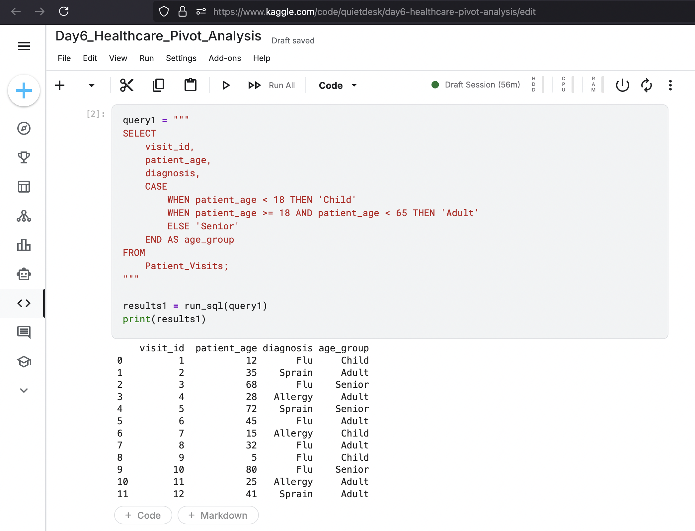
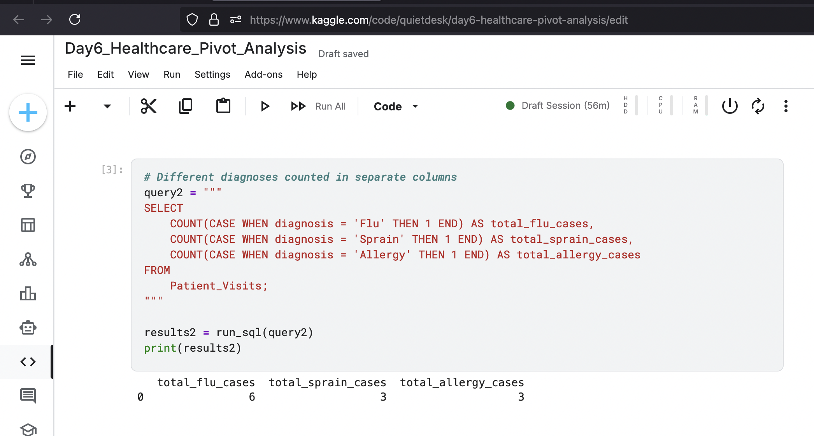
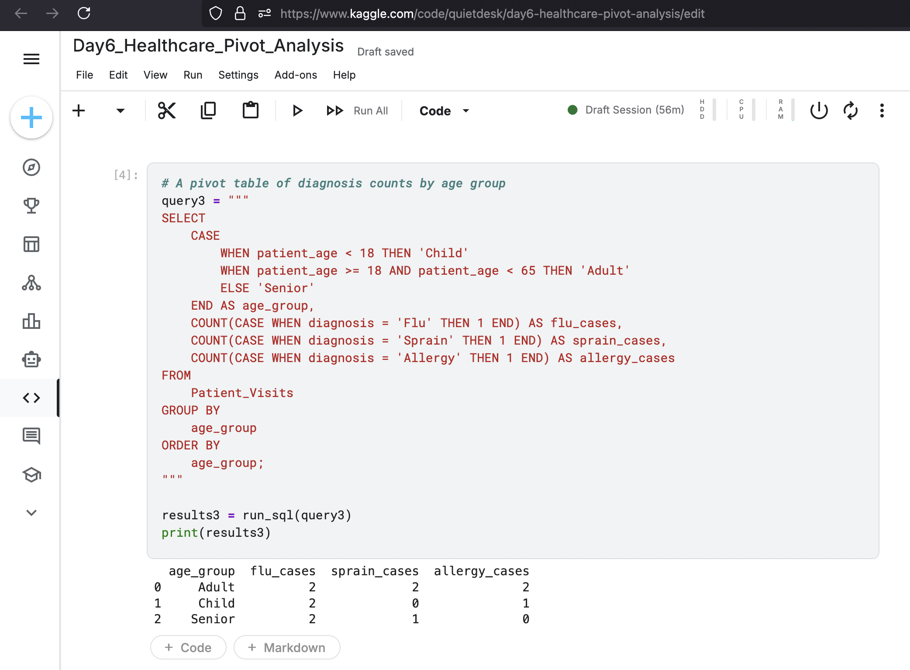

Project 6: Healthcare Analytics - Pivoting Data for Reporting
Project Overview

This project focuses on a crucial data transformation technique used in business intelligence and reporting: pivoting. The goal was to transform a "long", transactional dataset of patient visits into a "wide" summary report. This is a common requirement for creating human-readable dashboards and reports for stakeholders. The analysis involved creating custom categories with CASE statements and then using conditional aggregation to pivot the data.

    Tools: SQL (within a Python/pandasql environment), Kaggle Notebooks

    Core Concepts: Advanced CASE statements, Conditional Aggregation, and Data Pivoting (transforming data from a long to a wide format).

Analysis and Key Queries

The analysis was a three-step process: first categorizing the data, then applying the core logic of conditional aggregation, and finally combining these to build the final report.
1. Creating Custom Categories (CASE Statement)

Before pivoting, the continuous patient_age data needed to be grouped into discrete categories ('Child', 'Adult', 'Senior'). A CASE statement was used to create this new age_group dimension for the summary report.

Query:
code SQL

SELECT

    visit_id,
    patient_age,
    CASE
        WHEN patient_age < 18 THEN 'Child'
        WHEN patient_age >= 18 AND patient_age < 65 THEN 'Adult'
        ELSE 'Senior'
    END AS age_group
    
FROM

    Patient_Visits;

  

Result:
This query successfully transforms a numeric column into a categorical one, a common first step in preparing data for a summary report.

2. The Logic of Pivoting (Conditional Aggregation)

The core technique for pivoting in SQL is conditional aggregation. This involves placing a CASE statement inside an aggregate function like COUNT() or SUM(). This allows to count only the rows that meet a specific condition, effectively creating a new column for each condition.

Query:
code SQL

    
SELECT
    COUNT(CASE WHEN diagnosis = 'Flu' THEN 1 END) AS total_flu_cases,
    COUNT(CASE WHEN diagnosis = 'Sprain' THEN 1 END) AS total_sprain_cases,
    COUNT(CASE WHEN diagnosis = 'Allergy' THEN 1 END) AS total_allergy_cases
FROM
    Patient_Visits;

  

Result:
This query demonstrates the fundamental logic of pivoting data by creating separate aggregate columns for each diagnosis type from the raw transactional list.

3. Building the Final Pivot Table

By combining the age_group categorization with conditional aggregation and grouping by the new category, the final pivot table was constructed.

Query:
code SQL

    
SELECT

    CASE
    
        WHEN patient_age < 18 THEN 'Child'
        WHEN patient_age >= 18 AND patient_age < 65 THEN 'Adult'
        ELSE 'Senior'
    END AS age_group,
    COUNT(CASE WHEN diagnosis = 'Flu' THEN 1 END) AS flu_cases,
    COUNT(CASE WHEN diagnosis = 'Sprain' THEN 1 END) AS sprain_cases,
    COUNT(CASE WHEN diagnosis = 'Allergy' THEN 1 END) AS allergy_cases
FROM
    Patient_Visits
GROUP BY
    age_group
ORDER BY
    age_group;

  

Result:
This final query produces a clean, wide-format summary table that shows the total number of visits for each diagnosis, broken down by patient age group. This is a classic pivot table and a common reporting requirement.

